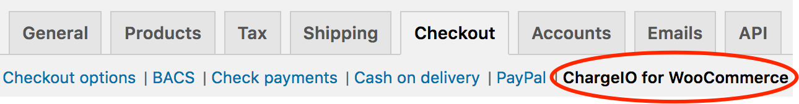
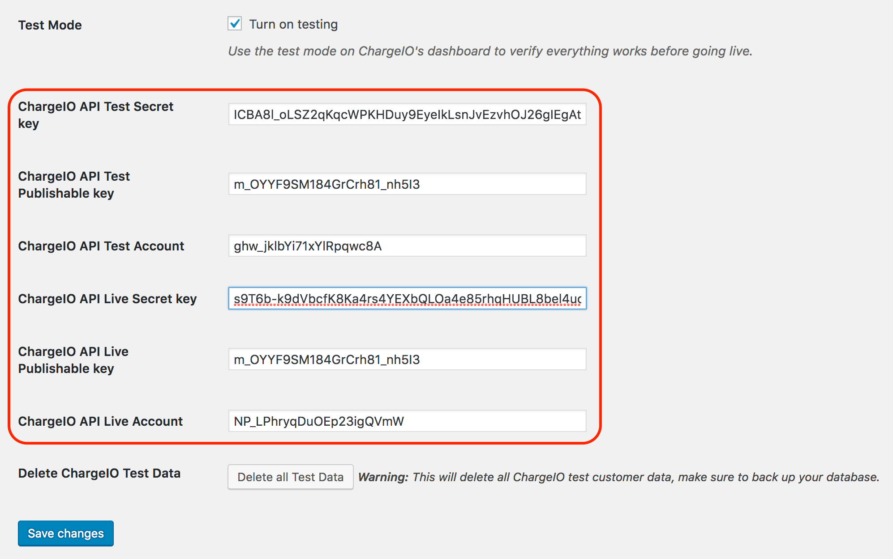

# ChargeIO for WooCommerce

> A WordPress plugin that integrates the [AffiniPay Payment Gateway](https://developers.affinipay.com/reference/api.html#PaymentGatewayAPI) (aka ChargeIO) with your WooCommerce site.

Plugin version: 1.5

This plugin allows you to accept secure, PCI-compliant credit card payments on your WooCommerce site without passing sensitive cardholder data through your WordPress server.

## Requirements
- An [AffiniPay](https://affinipay.com) merchant account
- WordPress 4.4+
- WooCommerce 3.0+

# Installation

> Be sure to install, activate, and configure WooCommerce before installing this plugin. You must also enable shipping and add a [shipping zone](https://docs.woocommerce.com/document/setting-up-shipping-zones/) in your WooCommerce settings to run a charge.

## Recommended Installation

1. Login to your Wordpress site's admin panel and select **Plugins** from the navigation sidebar

2. Click the **Add New** button at the top of the **Plugins** page

3. Search for **Affinipay ** and click **Install Now** on the **ChargeIO for WooCommerce** plugin

## Manual Installation

1. Visit the [plugin home page](https://wordpress.org/plugins/affinipay-woocommerce/)

2. Click the **Download** button

3. [Upload](https://codex.wordpress.org/Managing_Plugins#Manual_Plugin_Installation) the zip file to your WordPress instance

## Configuration
After installing and activating the plugin, you must configure it with your [AffiniPay gateway credentials](https://developers.affinipay.com/guides/payment-form-getting-started.html#obtain-credentials) (e.g., [test/live- mode](https://developers.affinipay.com/basics/account-management.html#test-live-creds) public key, secret key, and primary account ID).

If you have more than one [merchant account](https://developers.affinipay.com/basics/account-management.html#merchant-accounts) (e.g., trust, operating, other) associated with your AffiniPay profile, you must use the primary account. Contact [support](mailto:devsupport@affinipay.com) if you need help identifying your primary merchant account. You can also retrieve your merchant account details from the [API](https://developers.affinipay.com/reference/api.html#GetCurrentMerchant). Look for the `"primary": true` property inside the `merchant_accounts` array in the JSON response. The corresponding `id` and `name` are your primary account's ID and name. The following example shows a partial response:
```
...
"merchant_accounts": [
          {
ACCOUNT ID--->"id": "wKgFeDz5HF-BPPl08dcADQ",
              "status": "ACTIVE",
ACCOUNT NAME->"name": "Operating",
PRIMARY?----->"primary": true,
              "required_payment_fields": "name",
              "cvv_policy": "REQUIRE_MATCH_LENIENT",
              "avs_policy": "ADDR_OR_POSTAL_CODE_LENIENT",
              "ignore_avs_failure_if_cvv_match": false,
              "transaction_allowed_countries": "US,CA"
          },
...
```


1. Log in to your WordPress admin dashboard.

2. Click **WooCommerce** > **Settings** > **Checkout** > **ChargeIO for WooCommerce**.

    

3. Check the **Test Mode** checkbox.

  _**Note:** Test mode helps you verify that the integration is working as expected before accepting payments from clients. Check/uncheck the **Test Mode** checkbox and click **Save** to turn test mode on/off._

4. Enter your test- and live-mode public/secret keys and account IDs in the following fields:

    

5. Click **Save Changes**.

That's all the configuration you need to do for this plugin. Next, try running a credit card transaction on your site using a [test card](https://developers.affinipay.com/reference/api.html#TestCardNumbers). Log in to your [AffiniPay merchant account](https://secure.affinipay.com) to see transaction details.

## Contribute
Contributions in the form of GitHub pull requests are welcome. Please adhere to the following guidelines:
  - Before embarking on a significant change, please create an issue to discuss the proposed change and ensure that it is likely to be merged.
  - Follow the coding conventions used throughout the project, including 2-space indentation and no unnecessary semicolons. Many conventions are enforced using eslint.
  - Any contributions must be licensed under the GPL license.

## License
  [GPL](./LICENSE) © AffiniPay LLC
